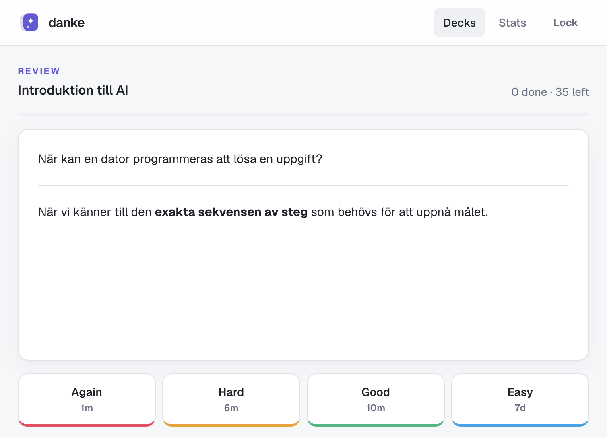

<div align="center">

# 🗂️ danke

**Self-hosted, markdown-first spaced repetition.**

<a href="#quick-start">Quick start</a> ·
<a href="docs/ARCHITECTURE.md">Architecture</a> ·
<a href="https://github.com/d-ismlv/danke/pkgs/container/danke">Container image</a>




</div>

A flashcard app you host yourself — an Anki alternative that's actually pleasant
on desktop and mobile. Write cards in Markdown, review them with a modern
scheduler (FSRS), and keep everything in one SQLite file you own. Built because
Anki's engine is great but its app gets in the way.

## Features

- ✍️ **Markdown cards** — GFM, code, math (KaTeX), and local images with a live-preview editor
- 🖼️ **Image uploads** — choose, drag, or paste JPEG, PNG, WebP, and GIF images into either side
- 🗂️ **Decks & sub-decks** to organize by topic
- 🧠 **FSRS scheduling** — Again / Hard / Good / Easy, with interval previews
- 🔁 **Practice anytime** — revisit a completed deck or one card without changing its schedule
- ↺ **Progress reset** — explicitly reset one card or a whole deck when you want a fresh start
- 📥 **Bulk import** — paste delimited text, or [generate cards from any URL](docs/flashcard-prompt.md)
- 📈 **Progress** — due counts, streak, and an activity heatmap
- 🔒 **Password login** for the whole app
- 📱 **Responsive** light/dark UI
- 🐳 **One container, one SQLite file** — trivial to self-host

## Quick start

### Docker

```yaml
# docker-compose.yml
services:
  danke:
    image: ghcr.io/d-ismlv/danke:latest
    ports: ["32323:32323"]
    environment:
      - AUTH_PASSWORD=change-me
    volumes:
      - danke-data:/app/data
    restart: unless-stopped

volumes:
  danke-data:
```

```bash
docker compose up -d          # then open http://localhost:32323
```

Set a password, that's it — the session secret is generated on first run. Put it
behind a TLS-terminating reverse proxy (nginx-proxy-manager, Caddy, …) pointed at
port `32323`. All state lives in the `danke-data` volume — the SQLite database
and uploaded images are backed up together.

### Local

```bash
npm install
npm run migrate   # create the local SQLite database
npm run dev       # http://localhost:3000
```

## Configuration

| Variable | Purpose |
|---|---|
| `AUTH_PASSWORD` | Login password |
| `AUTH_SESSION_TOKEN` | Session cookie secret — auto-generated if unset |
| `DANKE_DATA_DIR` | Database location (default `/app/data`) |
| `TZ` | Timezone (optional) |

## How it works

One Next.js (App Router) process serves the UI and API; cards and scheduling
live in SQLite via Drizzle, driven by [ts-fsrs](https://github.com/open-spaced-repetition/ts-fsrs).
The data model, review loop, and layout are in
**[docs/ARCHITECTURE.md](docs/ARCHITECTURE.md)**.

<sub>*danke — “thanks” in German.*</sub>
