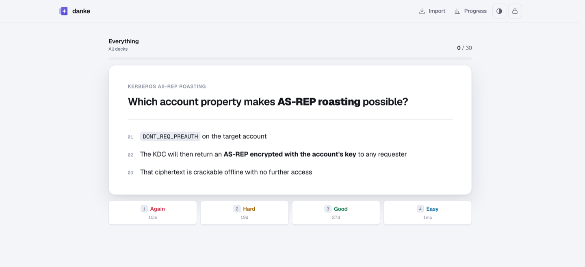

<div align="center">

# 🗂️ danke

**A self-hosted study app for cards you write yourself.**

<a href="#quick-start">Quick start</a> ·
<a href="#the-card-format">Card format</a> ·
<a href="docs/ARCHITECTURE.md">Architecture</a> ·
<a href="https://github.com/d-ismlv/danke/pkgs/container/danke">Container image</a>




</div>

Decks hold topics, topics hold cards, and a card is a question with two to six
points that answer it. You paste your content in, you press Study, and a modern
scheduler (FSRS) decides what comes back and when. Everything lives in one
SQLite file you own.

## Features

- 🗂️ **Deck → Topic → Card**, two levels deep and no deeper
- 🎯 **One study button** — due cards first, then anything unseen, then the rest.
  No practice mode, no drill mode, no modes at all
- 📥 **Import with a live preview** that says what will be added and what will be
  updated, and refuses to write anything while a single line is wrong
- ♻️ **Re-import safely** — a corrected paste updates the questions it already
  has and keeps their schedules
- 🧠 **FSRS scheduling** — Again / Hard / Good / Easy, with interval previews
- 📈 **Progress** — how much is holding, whether you're showing up, which deck is
  weakest
- 🔒 **Password login** for the whole app
- 📱 **Responsive** light/dark UI, keyboard-driven on desktop
- 🐳 **One container, one SQLite file**

## Quick start

### Docker

```yaml
# docker-compose.yml
services:
  danke:
    image: ghcr.io/d-ismlv/danke:latest
    ports: ["32323:32323"]
    environment:
      - AUTH_PASSWORD=change-me
    volumes:
      - danke-data:/app/data
    restart: unless-stopped

volumes:
  danke-data:
```

```bash
docker compose up -d
```

Then open http://localhost:32323. Set a password and that's it — the session
secret is generated on first run. Put it behind a TLS-terminating reverse proxy
pointed at port `32323`. All state lives in the `danke-data` volume.

### Local

```bash
npm install
npm run migrate   # create the local SQLite database
npm run dev       # http://localhost:3000
```

## The card format

Import takes a plain-text paste. A card is a `#` question line followed by its
points; repeat for every card. Blank lines are ignored, and a point may wrap onto
an indented line.

```markdown
# What is **deconfliction** during an offensive exercise?

- A controlled process for **separating exercise activity from real malicious activity**
- It gives incident responders authoritative context without dismissing evidence
- It protects production response and exercise credibility
- It remains active from preparation through cleanup

# Which ticket does `mimikatz` forge for a **Golden Ticket**?

- A **TGT** signed with the `krbtgt` account hash
- Any service ticket can then be requested from it normally
```

Rules, all enforced before anything is written:

| | |
|---|---|
| Points per card | between **2** and **6** |
| Question | one line, starting with a single `#` |
| Duplicate questions | not allowed within a topic |
| Formatting | `**bold**`, `*italic*`, `` `code` ``, ``**`bold code`**`` — and nothing else |

One paste goes into one topic, which you pick — or name, to create — on the
import screen. The format is on that screen too, behind **Show format**, so it is
never something you have to remember.

## Configuration

| Variable | Purpose |
|---|---|
| `AUTH_PASSWORD` | Login password |
| `AUTH_SESSION_TOKEN` | Key the session cookie is signed with — auto-generated if unset. Changing it signs every device out. |
| `DANKE_DATA_DIR` | Database location (default `/app/data`) |
| `TZ` | Timezone (optional) |

## Upgrading from v1

The content model changed and nothing maps across. On first boot the migration
copies your old database to `danke.db.pre-v2-<date>.bak` beside itself, then
rebuilds for the new model — import your content again afterwards.

<sub>*danke — "thanks" in German.*</sub>
