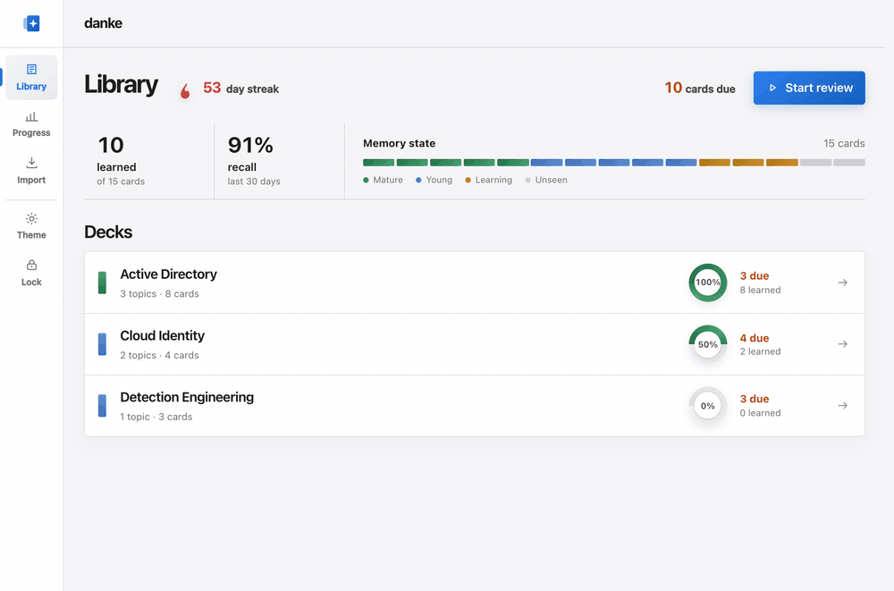

<div align="center">


# danke

**A self-hosted spaced-repetition app for cards you write yourself.**

[Quick start](#quick-start) · [Card format](#card-format) · [Architecture](docs/ARCHITECTURE.md) · [Image](https://github.com/d-ismlv/danke/pkgs/container/danke)




</div>

## What it is

Decks hold topics, topics hold cards, and a card is a question with two to six
points that answer it. Paste your notes in, press Study, and [FSRS](https://github.com/open-spaced-repetition/ts-fsrs)
decides what comes back and when. Everything lives in one SQLite file you own.

- **One study button** — due cards first, then unseen, then the rest. No modes.
- **Import with a live preview** of every card, and the line number of anything wrong.
- **Re-import safely** — a corrected paste updates questions it already has and keeps their schedules.
- **Colour that means something** — the mark beside a deck is how that deck is actually going, not a label you picked.
- **System / light / dark**, keyboard-driven, and readable from a phone to a 4K display.
- **One container, one volume.**

## Quick start

```yaml
# docker-compose.yml
services:
  danke:
    image: ghcr.io/d-ismlv/danke:latest
    ports: ["32323:32323"]
    environment:
      - AUTH_PASSWORD=change-me
    volumes:
      - danke-data:/app/data
    restart: unless-stopped

volumes:
  danke-data:
```

```bash
docker compose up -d
```

Open <http://localhost:32323>, sign in, import your first cards. Put it behind a
TLS-terminating reverse proxy. All state lives in the volume.

<details>
<summary>Run it locally</summary>

```bash
npm install
npm run migrate   # create ./data/danke.db
npm run dev       # http://localhost:3000
```

Set `AUTH_PASSWORD` in `.env.local` first — see [`.env.example`](.env.example).

</details>

## Card format

A `#` question line followed by its points. Repeat for every card.

```markdown
# Why does rotating `krbtgt` **twice** matter?

- KRBTGT retains its **two most recent** passwords
- One reset therefore leaves the previous key valid
- A second reset, after the full ticket lifetime, removes that remaining path
```

| | |
|---|---|
| Points per card | 2 to 6 |
| Question | one line, a single `#`, unique within its topic |
| Formatting | `**bold**`, `*italic*`, `` `code` ``, ``**`bold code`**`` |

Nothing is written while a single line is wrong.

## Configuration

| Variable | |
|---|---|
| `AUTH_PASSWORD` | Login password. Required. |
| `AUTH_SESSION_TOKEN` | Signing key for the session cookie. Generated on first run; changing it signs every device out. |
| `DANKE_DATA_DIR` | Database location. Default `/app/data`. |
| `TZ` | Timezone. Optional. |

---

<sub>MIT · *danke — "thanks" in German.*</sub>
