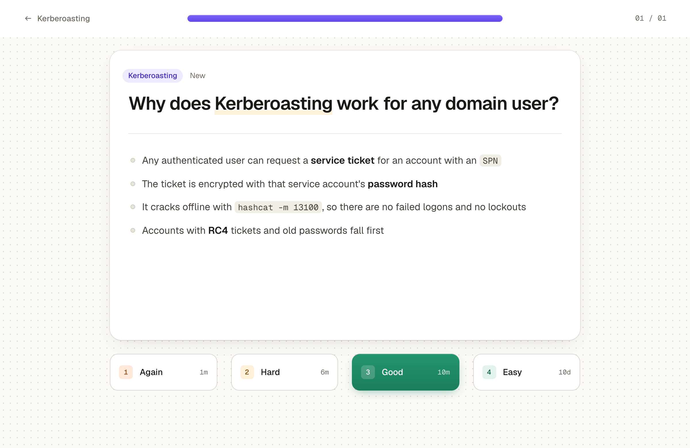

<div align="center">

<picture>
  <source media="(prefers-color-scheme: dark)" srcset="docs/card-dark.png">
  
</picture>

# danke


</div>

A self-hosted spaced-repetition app for flashcards you write yourself in Markdown.
Paste your notes in, press Study, and FSRS decides what comes back and when — everything lives in one SQLite file you own.

## Run

```bash
docker run -d --name danke -p 32323:32323 -e AUTH_PASSWORD=change-me -v danke-data:/app/data ghcr.io/d-ismlv/danke:latest
```

Or with Compose:

```bash
cat > docker-compose.yml <<'EOF'
services:
  danke:
    image: ghcr.io/d-ismlv/danke:latest
    ports:
      - "32323:32323"
    environment:
      - AUTH_PASSWORD=change-me
    volumes:
      - danke-data:/app/data
    restart: unless-stopped

volumes:
  danke-data:
EOF
docker compose up -d
```

Open <http://localhost:32323> and sign in with `change-me`.
